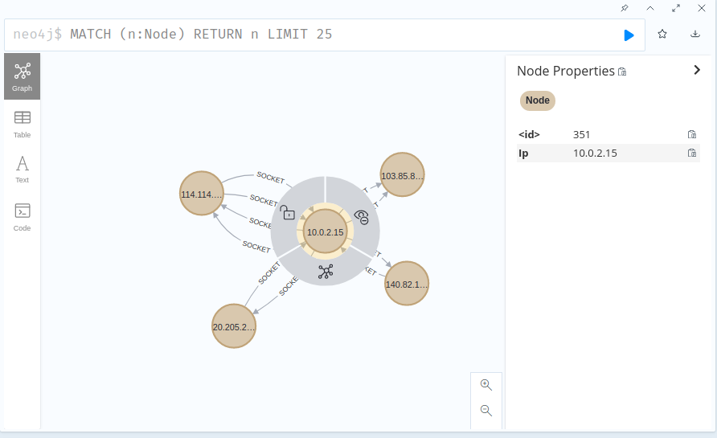

# watch-dog

watch-dog利用ebpf的能力，监听指定网卡的流量来达到旁路检测流量的目的，并使用图数据库neo4j保存节点之间的流量关系。


## Get
```shell
go get github.com/TomatoMr/watch-dog
```

## Install 
```shell
make build
```

## Usage
```shell
sudo ./watch-dog --config ./daemon/watch-dog.yaml
```

## config
```yaml
log-level: "debug"  # 日志级别
log-path: "./log/watch-dog.log"  # 日志路径
ifaces:  # ebpf程序要attach的网卡列表
  - enp0s3
neo4j:  # neo4j信息
  db-uri: "bolt://localhost:7687"
  username: "neo4j"
  password: "123456"
```

